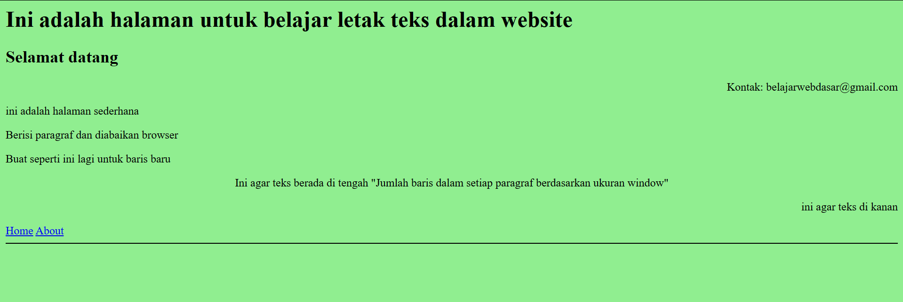
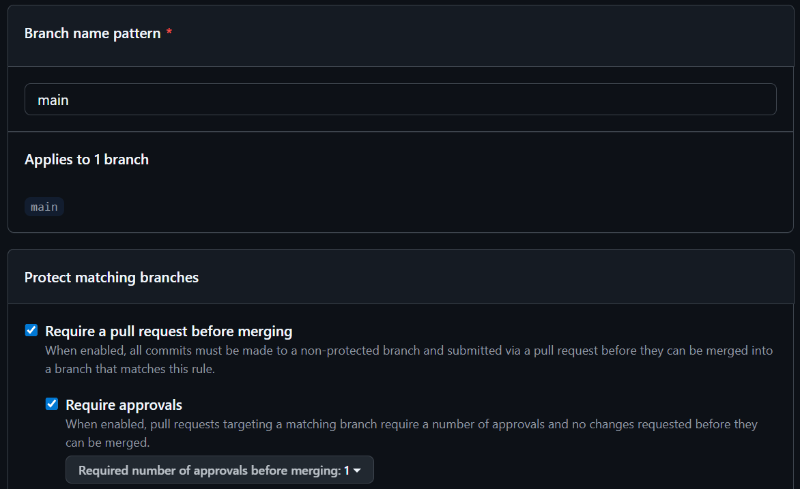

=====================================
# Praktikum Git - 25-565088-SV-26911

## Deskripsi Project
Project ini dibuat untuk memenuhi tugas praktikum pemrograman komputer menggunakan Git dan GitHub.  
Project ini berisi halaman web sederhana yang dibuat menggunakan HTML serta latihan penggunaan Git seperti branching, merge, conflict resolution, dan interactive rebase.

Tujuan utama dari project ini adalah untuk memahami:
- Manajemen version control menggunakan Git
- Penggunaan branch
- Penyelesaian konflik (merge conflict)
- Rebase dan squash commit
- Pengelolaan repository di GitHub

---

## Cara Menjalankan Project
1. Clone repository:
    ```bash
    `git clone  https://github.com/ramosrambalangi2-commits/praktikum-git-25-565088-SV-26911.git

2. Masuk folder:
    ```bash
    `cd praktikum-git-25-565088-SV-26911

3. Buka file index.html di browser

## Screenshot Website


## Dokumentasi Perintah Git
1. Inisialisasi dan Clone Repository
    git clone <repo-url> :
    Digunakan untuk mengambil repository dari GitHub ke komputer lokal.

    cd <folder-repo> :
    Digunakan untuk masuk ke dalam folder project yang sudah di-clone.

2. Branching
    git checkout -b nama-branch :
    Digunakan untutk membuat branch baru sekaligus berpindah ke branch tersebut.

    git checkout main :
    Digunakan untuk berpindah kembali ke branch utama (main).


3. Staging dan Commit
    git add . :
    Digunakan untuk menambahkan semua perubahan file ke staging area.

    git commit -m "pesan commit" :
    Digunakan untuk menyimpan perubahan ke dalam riwayat Git (commit).
    
    Contoh jenis pesan commit:
        feat: untuk menambahkan fitur baru
        fix: untuk memperbaiki bug
        style: untuk perubahan tampilan
        chore: untuk konfigurasi atau file tambahan
        docs: untuk perubahan dokumentasi

4. Push ke GitHub
    git push origin nama-branch :
    Digunakan untuk mengupload branch ke repository GitHub.

    git push origin main :
    Digunakan untuk mengupload perubahan ke branch utama.


5. Merge Branch
    git merge nama-branch :
    Digunakan untuk menggabungkan perubahan dari branch lain ke branch yang sedang aktif.

6. Conflict Resolution
    Jika terjadi konflik saat merge, lakukan perbaikan manual pada file yang bermasalah, kemudian jalankan:
    git add index.html
    lalu
    git commit -m "fix: resolve merge conflict" :
    Perintah ini digunakan setelah konflik diselesaikan.

7. Interactive Rebase (Squash Commit)
    git rebase -i HEAD~3 :
    Digunakan untuk menggabungkan beberapa commit terakhir menjadi satu agar lebih rapi.

    Perintah yang digunakan dalam rebase:
        pick: menggunakan commit
        squash: menggabungkan commit
        drop: menghapus commit

8. Force Push
    git push origin feature/dark-mode --force :
    Digunakan setelah melakukan rebase karena riwayat commit berubah.

9. Git Log
    git log --oneline --graph :
    Digunakan jika ingin menampilkan riwayat commit secara ringkas dan dalam bentuk visual.

## Commit History


## Branch Protection Rule

